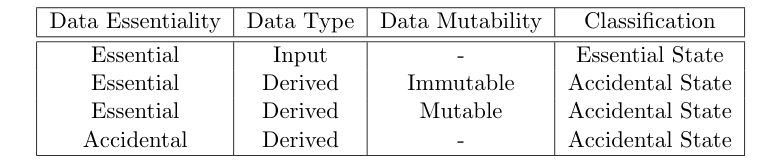
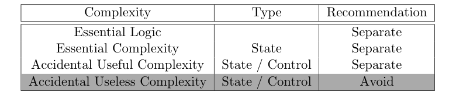
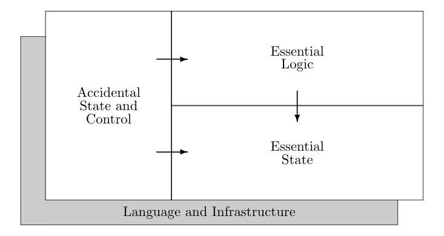

# Out of the Tar Pit — S7: Recommended General Approach

This is the theoretical core of the paper. The authors' two recommendations are: **avoid** complexity where possible, and **separate** it where not.

**The ideal world.** Even in the ideal world, some state is essential -- specifically, input data that the system may need to refer to in the future. All derived data (whether immutable or mutable) corresponds to [[accidental-state|accidental state]] and can be omitted by re-deriving it on demand. Control is entirely accidental: the informal requirements never mention ordering, so developers should not have to specify it. The ideal approach is pure [[declarative-programming]]: specify what is required, not how.

**Real-world limitations.** Performance concerns may require some accidental state (e.g., caching derived data) and control (e.g., parallelism). In rare cases, accidental state offers the most natural way to express logic (e.g., game AI position tracking). But these should be the exception, not the rule.

**Separation.** The system should be cleanly divided into three components with restricted relationships. **Essential State** is the foundation, specified in complete isolation -- changes here may cascade to other components, but nothing can change it. **Essential Logic** expresses what must be true in terms of the state, referencing essential state but never accidental components -- changes in accidental specification can never require changes here. **Accidental State and Control** consists of performance hints and optimizations -- changes here never affect other components.

Each component should use a different, restricted language tailored to its purpose. The weaker each language, the easier to reason about. This is the "power corrupts" principle applied to architecture: restricting expressive power enables understanding.

The authors warn emphatically against designing for performance upfront: "there can be no comparison between the difficulty of improving the performance of a slow system designed for simplicity and that of removing complexity from a complex system designed to be fast."

Part of [[out-of-the-tar-pit]]

## Related
- [[essential-vs-accidental-complexity]] — the classification enabling this approach
- [[accidental-state]] — state that can be eliminated or separated
- [[declarative-programming]] — the ideal-world paradigm
- [[designing-for-performance]] — Ousterhout's compatible advice
- [[out-of-the-tar-pit-s06]] — Accidents and Essence
- [[out-of-the-tar-pit-s09]] — Functional Relational Programming
