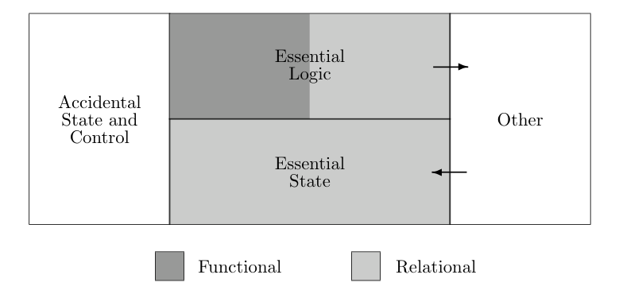

# Out of the Tar Pit — S9: Functional Relational Programming

[[Functional-relational-programming]] (FRP) is the concrete architecture the authors propose for applying the avoid-and-separate principles. FRP is currently hypothetical but grounded in widely-proven ideas from functional programming and the relational model. All essential state takes the form of relations, and all essential logic is expressed using relational algebra extended with pure user-defined functions.

**Architecture.** An FRP system has four components. **Essential State** specifies base relvars (names and types only). Data is treated as essential state only when directly input by a user. **Essential Logic** defines derived relations, [[integrity-constraints]], and pure functions. No consideration of performance is allowed here -- concepts like "denormalization for performance" make no sense because physical storage is handled separately. **Accidental State and Control** consists of isolated, declarative performance hints: which derived relvars to store, what physical storage mechanisms to use, parallelism recommendations. Hints cannot refer to each other. **Other** handles interfacing through feeders (converting input into relational assignments) and observers (generating output from derived-relation changes).

**Benefits.** The separation yields powerful benefits. The system can never enter a "bad state" from logic errors -- fixing the logic is sufficient, with no need to scan and correct stored data. The functional component has no access to state at all, is fully [[referential-transparent]], and offers excellent testing prospects. [[Integrity-constraints]], being declarative and non-interacting, grow only linearly in complexity. The relational component has no ordering at all -- it is simply a set of equations. The relational model's flat structure avoids the subjectivity and referential transparency problems of data abstraction.

The authors also argue against unnecessary data abstraction: subjective grouping of data and hidden internal structure erode referential transparency. The relational model's flat structure and access path independence avoid both problems. FRP permits disjoint union types but not product types -- this restriction is deliberate to avoid unnecessary data abstraction.

Part of [[out-of-the-tar-pit]]

## Related
- [[functional-relational-programming]] — the proposed architecture
- [[referential-transparency]] — guaranteed for the functional component
- [[integrity-constraints]] — declarative, non-interacting consistency rules
- [[declarative-programming]] — the paradigm underlying FRP
- [[out-of-the-tar-pit-s07]] — Recommended General Approach
- [[out-of-the-tar-pit-s08]] — The Relational Model
- [[out-of-the-tar-pit-s10]] — Example of an FRP System
